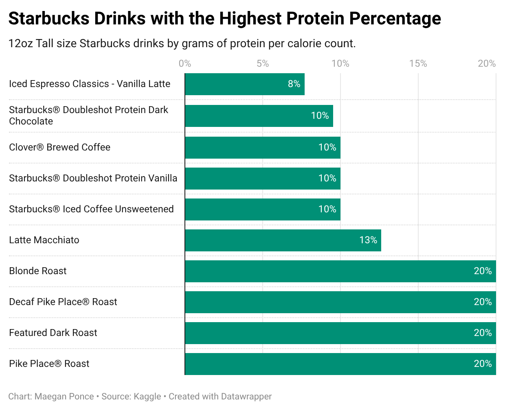

# Protein in Starbucks Drinks

## Data Sourcing

The dataset on nutritional information for various Starbucks drinks was downloaded from Kaggle, posted by Rachael Tatman in collaboration with Starbucks. [Link to Dataset.](https://www.kaggle.com/datasets/starbucks/starbucks-menu/data) The original source for the data is the official [Starbucks website.](https://www.starbucks.com/menu/catalog/nutrition#view_control=nutrition&drink=brewed-coffee)

The dataset is based on the Starbucks menu from 2015. Thus, it may be outdated and fail to reflect current menu options. Some drinks listed in the dataset have missing data.

Menu labeling requirements set by the federal Food and Drug Administration legally require chain restaurants with 20 or more locations to list calorie counts and provide written nutritional information.

Providing false information could result in fines, product seizures, injunctions to halt sales, criminal prosecution, class action lawsuits, and severe reputational consequences for Starbucks. As a result, the data provided by Starbucks is reasonably trustworthy.

## Data Analysis

Link to [Starbucks Drinks](https://docs.google.com/spreadsheets/d/1wST1Gs_KWrpvbDZKvlQDv4_uY5zDmPmVElSazJOhqbY/edit?usp=sharing) Google Sheet.

The dataset contains information for 177 different Starbucks drinks. Separate columns contain values for the calories, fat, carbohydrates, fiber, protein, and sodium within a 12oz (Tall) size of each drink.

After importing the dataset CSV into Google Sheets, I applied a filter to remove drinks with missing data from display. I began sorting through different values, filtering to see which drinks stood at the extremes of calorie, fat, and protein content.

In 2026, a high-protein diet has been one of the biggest emphases in wellness circles. Due to this recent trend in the dietary realm, I took a special interest in protein content.

I decided to create a new column to look at the percent of protein in regard to the amount of calories. I used `=DIVIDE()` with the "Protein" column as the first argument and the "Calories" column as the second argument, then converted the values to percentages.

I created different pivot tables for the "Protein" and "Calories" columns as well as my new "Protein/Calories %" column and sorted the drinks in descending order by each of these values.

I created bar charts of the top 10 drinks in each category. I found "Protein" and "Protein/Calories %" to be the most interesting comparison, so I took that into Datawrapper to create visualizations.

## Data Visualizations

## Summary

